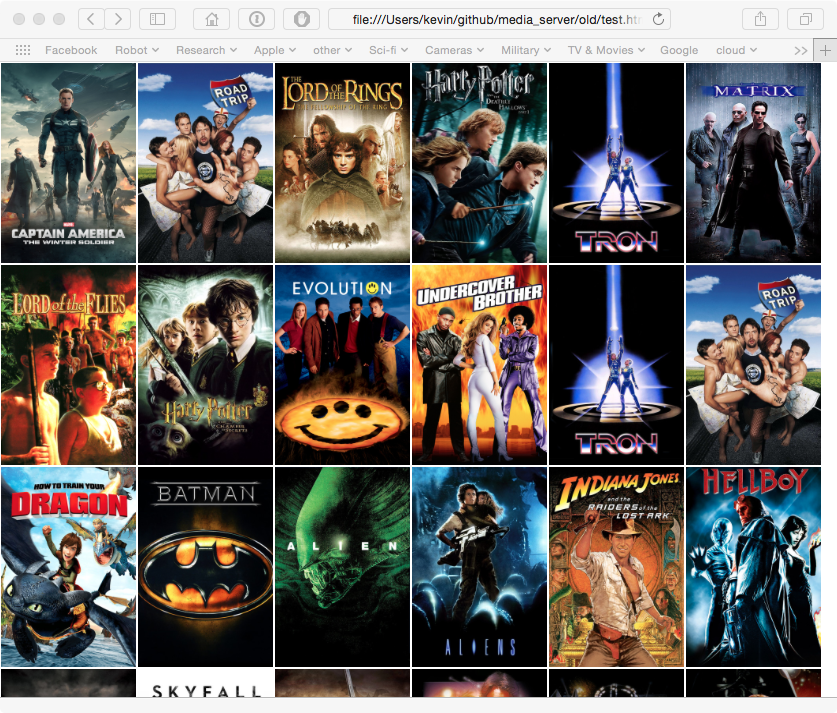
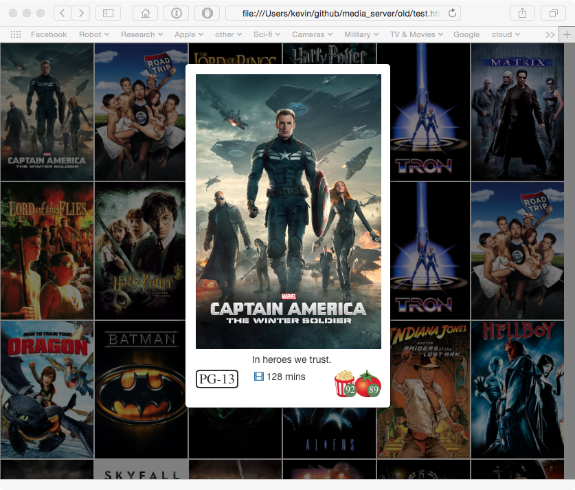

# Movie Server

[]
(https://travis-ci.org/walchko/movie-server)
[]
(https://www.npmjs.com/package/movie-server)
[]
(https://www.npmjs.com/package/movie-server)
[]
(https://www.npmjs.com/package/movie-server)

## Requirements

This uses both [tmdb.org](http:tmdb.org) and [rotten tomatoes](http://rottentomatoes.com)
to get information about movies and generate a webpage. The following libraries are needed:

	pip install media

You will also have to sign-up for free API keys at both locations in order to access 
their info.

## Usage

Then start it running

	npm run
	npm run-script debug

Some of the options:

	[kevin@Tardis movie-server]$ node server.js --help

	  Usage: server [options]

	  Movie server

	  Options:

		-h, --help           output usage information
		-V, --version        output the version number
		-p, --port <port>    Http server port number
		-m, --movies <path>  Location of movies
		-w, --web <path>     Location of webpage

Now navigate to `localhost:8000/movie.html` to access your movies via the web browser.

### API

You can also use `GET` and `PUT` methods:

* `GET` retrieves all of the movie data in json format
* `PUT` tells the program to reload the movie database because something has changed 

	curl -i -X GET http://tardis.local:8000/api 
	curl -i -X PUT http://tardis.local:8000/api 

## Install

### OS X

The webserver is nodejs and uses http-server. To install on OSX:

	brew install node

### Raspberry Pi

The nodejs for rpi is very old. You can download it from [nodejs.org](http://nodejs.org) 
and build it from source. Then use the `npm` above to install `http-server`. 

